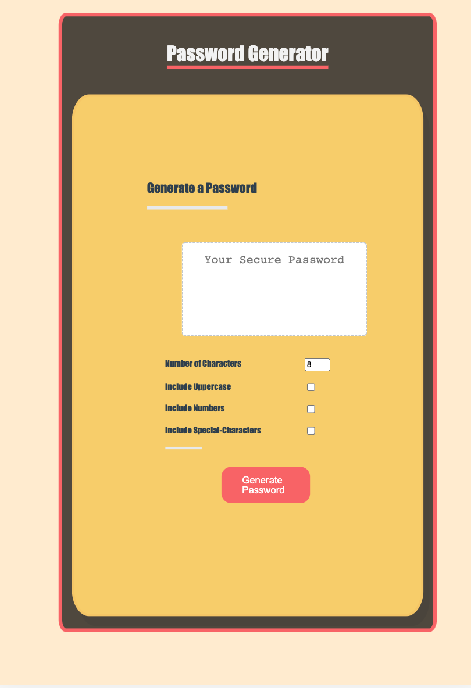

# password-generator

---

## Table of Contents

- [Description](#description)
- [How To Use](#how-to-use)
- [References](#references)
- [License](#license)
- [Author Info](#author-info)

---

## Purpose
Generating random password. 

## Description
A web-based application for generating random passwords. The application allowes for specifiying the type and the lenght of chractures to be generated. Options include the latin charset number 65-90 (CAPITAL) letters, the latin charset number 97-122 (small), the latin charset number 48-57 (digits),and the charset numbers 58-64, 91-96, and 123-126. Small letters are the defult option. The lenght option allowes for choosing between 8 to 128 chrachters per generated password. 

#### Technologies
* HTML5
* CSS
* JavaScript
* markdown

## Built With
* HTML5
* CSS
* JavaScript
* markdown
---

## How To Use
1-Type the number of chractures you wish your password to be
2-Check the boxes that fits your criteria.
3- click on the "Generate password" button. 
4- copy your password from the textarea.

#### Installation
N/A

---

## References
source code reposotory
W3 school charset
???
????
???

---

## License

UConn bootcamp class License

Copyright (c) [2022] [CatFishChisal]

---

## Author Info

-name- [AbdEllah,Philemon]
-email- [philemon.kirlles@gmail.com]
-social media- [???]
-protfolio- [github reposotory]
## Website
https://philemonkirlles.github.io/password-generator/
---

## Contribution and credit
1- Philemon AbdEllah Kirlles

